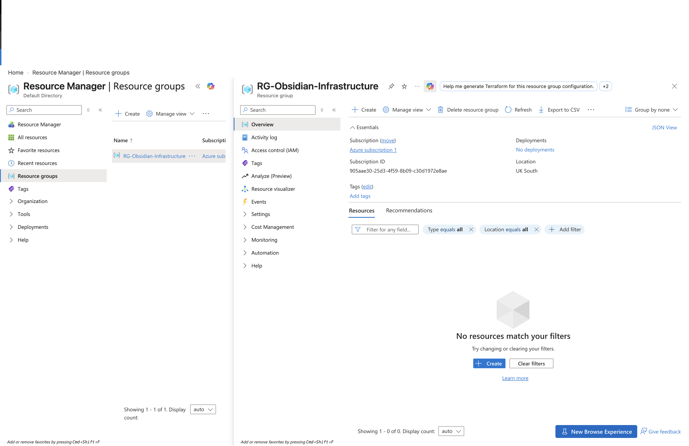
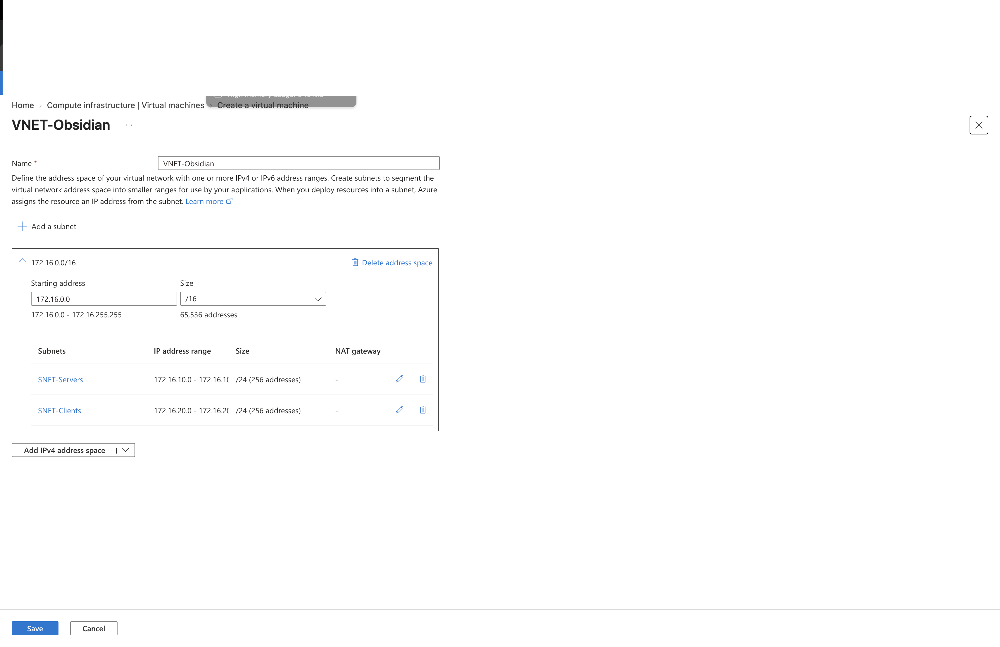

# Phase 1 — Azure Foundation

## Overview

The first stage of the Obsidian infrastructure project was to create the Azure foundation that would host the Windows Server environment.

The goal was to build a clear network structure that separated server workloads from client devices and provided predictable private IP addressing for the core infrastructure.

## Resources Created

### Resource Group

`RG-Obsidian-Infrastructure`

Used to contain and organise the resources for the Obsidian project.

### Virtual Network

`VNET-Obsidian`

Address space:

`172.16.0.0/16`

### Server Subnet

`SNET-Servers`

Address range:

`172.16.10.0/24`

This subnet is used for the Windows Server infrastructure, including:

- DC01
- DC02
- FS01

### Client Subnet

`SNET-Clients`

Address range:

`172.16.20.0/24`

This subnet is used for client devices such as:

- CLIENT01

## Planned Private IP Addressing

- DC01 — `172.16.10.10`
- DC02 — `172.16.10.11`
- FS01 — `172.16.10.20`
- CLIENT01 — `172.16.20.x`

## Why the Network Was Designed This Way

Separating servers and client devices into different subnets provides a clearer network structure and makes it easier to apply different security and access controls later in the project.

Static private addressing is used for infrastructure servers so that services such as Active Directory and DNS can rely on predictable IP addresses.

## Evidence

### Resource Group

### Virtual Network and Subnets

## Phase Outcome

The Azure network foundation was successfully created and is ready to support the Obsidian Windows Server environment.
